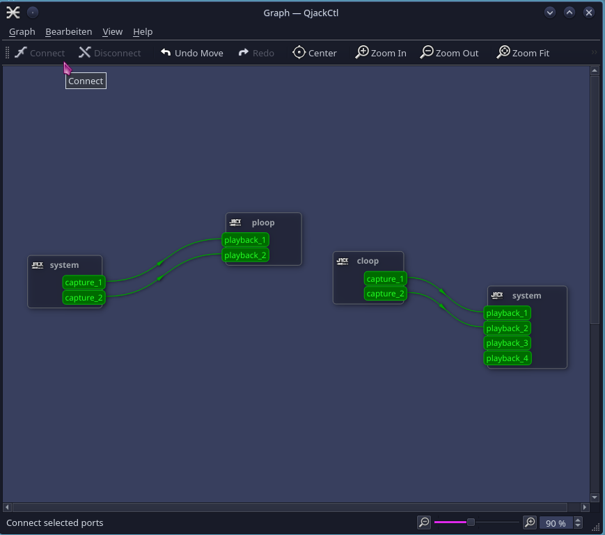
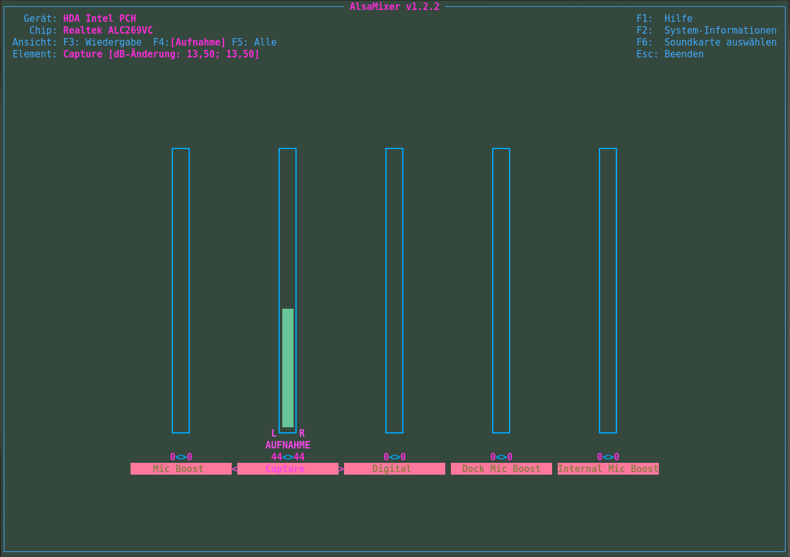

# ALSA-only-Jack-Archlinux-Audio-Config

Here I like to share my realtime audio configuration on a (pulseaudio-free) Archlinux system. I use a Lenovo laptop with Intel chipset and a Presonus AudioBox VSL. My configuration is not perfect and lacks some functions. But this is due to some missing configurations. Actually I have a (partly) functional Alsa-Jack-Loopback-System which also works in the garden where I do not have the USB audiobox.  

My personal (and unfinished) ALSA-to-Jack-Bridge configuration is based on the great tutorial of markc: https://alsa.opensrc.org/Jack_and_Loopback_device_as_Alsa-to-Jack_bridge   
     
As addition to the setup by markc I like to add the setup of falkTX of KXStudio (https://github.com/falkTX).
falkTX's script and .asoundrc friendly fetched from http://gamesplusone.com/alsa_to_jack.html which was 
originally hosted on the WineHQ Sound wiki page http://wiki.winehq.org/Sound
and written and developed by falkTX of KXStudio http://kxstudio.sourceforge.net/Main_Page .

---

## This repository hosts several different GitHub branches:
* One with the 'falkTX' version and 
* the other with the 'markc' version. 
* snd-aloop_in-progress: In progress :: A new sound setup (multiple sound devices) from scratch

---

The actual status of this configuration of this repository branch is as follows:

PRO:
  - Realtime audio via loopback audio devices WITHOUT using the physical jack of the laptop.
  - A script helps to initialize the loopback devices in qjackctl's graph editor automatically.
  {:class="img-responsive"}
  
  - When turning off the external audio box I can use the built-in audio hardware nearly on-the-fly. I only need to change
    the audio device in qjackctl and restart the jack server.
  - Built-in microphone (Intel HDA PCH) works too, when configured in 'qjackctl' 
    (see -> qjackctl- configuration.README_in_German)
  
CONTRA:
  - There is no master 'Loopback' volume for increasing or lowering the audio volume. It needs to choose the corresponding
    audio hardware like 'VSL' or 'PCH' separately.
    
    {:class="img-responsive"}
    
  - Recording of Raw data: The built-in capture device sends my voice perfectly to a video conference system in
    a webrowser. But I am unable to record my voice in  parallel with Ardour or similar. A connection 'system, capture' -->  
    'ardour - Line in' results in rawdata noise.
    Maybe this can be solved by more Loopback devices and fine tuned connection scheme.
        
        You are welcome to give me some hints how I can get my onboard microphone back :)

---

